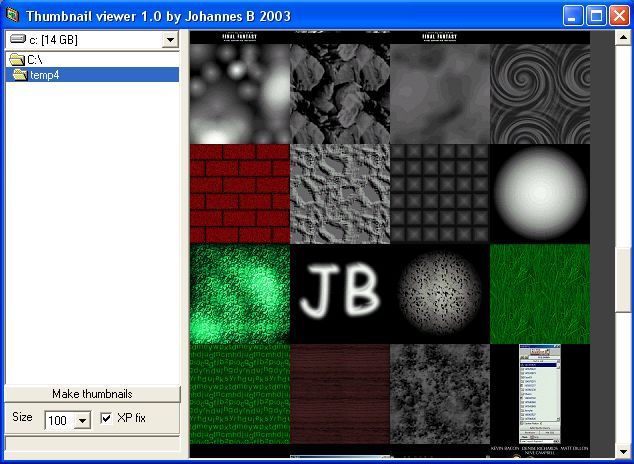



## Make thumbnails with aspect ratio\!

### Description

This will make thumbnails of all images in a directory. You can choose the size on the thumbnails and they will keep aspect ratio.

A viewer is also included!

Please vote or leave a comment!
 
### More Info
 

             |
---                |---
**Submitted On**   |2003-07-20 16:56:02
**By**             |[Johannes B](https://github.com/Planet-Source-Code/PSCIndex/blob/master/ByAuthor/johannes-b.md)
**Level**          |Intermediate
**User Rating**    |4.0 (8 globes from 2 users)
**Compatibility**  |VB 5\.0, VB 6\.0
**Category**       |[Graphics](https://github.com/Planet-Source-Code/PSCIndex/blob/master/ByCategory/graphics__1-46.md)
**World**          |[Visual Basic](https://github.com/Planet-Source-Code/PSCIndex/blob/master/ByWorld/visual-basic.md)
**Archive File**   |[Make\_thumb1617937202003\.zip](https://github.com/Planet-Source-Code/johannes-b-make-thumbnails-with-aspect-ratio__1-47064/archive/master.zip)

